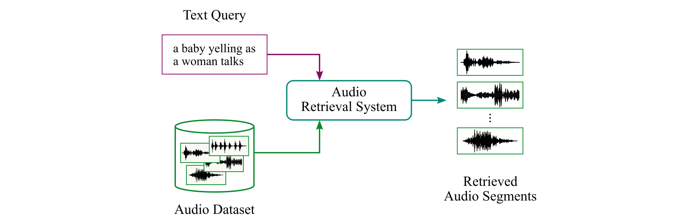
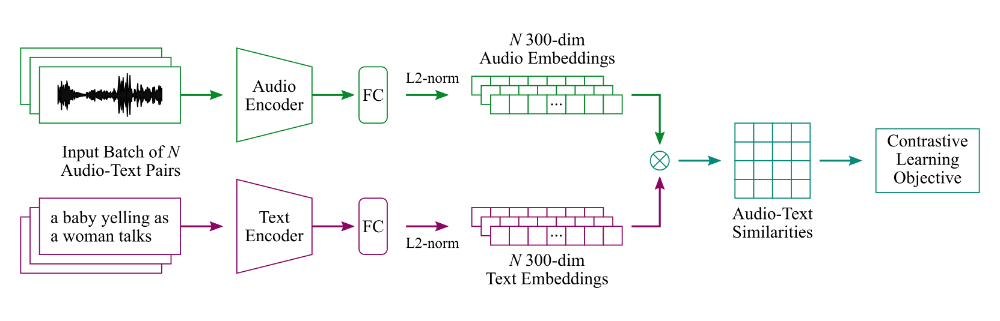

# Language-based Audio Retrieval in DCASE 2023 Challenge

This repository provides the baseline system for **Language-based Audio Retrieval** (Task 6B) in DCASE 2023 Challenge.



# Baseline Retrieval System



```
- Audio Encoder                   # fine-tuned PANNs, i.e., CNN14
- Text Encoder                    # pretrained Sentence-BERT, i.e., all-mpnet-base-v2
- Contrastive Learning Objective  # InfoNCE loss
```

# Quick Start

This codebase is developed with Python 3.9 and [PyTorch 1.13.0](https://pytorch.org/).

1. Check out source code and install required python packages:

```
git clone https://github.com/xieh97/dcase2023-audio-retrieval.git
pip install -r requirements.txt
```

2. Download the [Clotho](https://zenodo.org/record/4783391) dataset:

```
Clotho
├─ clotho_captions_development.csv
├─ clotho_captions_validation.csv
├─ clotho_captions_evaluation.csv
├─ development
│   └─...(3839 wavs)
├─ validation
│   └─...(1045 wavs)
└─ evaluation
    └─...(1045 wavs)
```

3. Pre-process audio and caption data:

```
preprocessing
├─ audio_logmel.py              # extract log-mel energies from audio clips
├─ clotho_dataset.py            # process audio captions, generate fids and cids
├─ sbert_embeddings.py          # generate sentence embeddings using Sentence-BERT (all-mpnet-base-v2)
└─ cnn14_transfer.py            # transfer pretrained CNN14 (Cnn14_mAP=0.431.pth)
```

4. Train the baseline system:

```
models
├─ core.py                      # dual-encoder framework
├─ audio_encoders.py            # audio encoders
└─ text_encoders.py             # text encoders

utils
├─ criterion_utils.py           # loss functions
├─ data_utils.py                # Pytorch dataset classes
└─ model_utils.py               # model.train(), model.eval(), etc.

conf.yaml                       # experimental settings
main.py                         # main()
```

5. Calculate retrieval metrics:

```
postprocessing
├─ xmodal_scores.py             # calculate audio-text scores
└─ xmodal_retrieval.py          # calculate mAP, R@1, R@5, R@10, etc.
```
